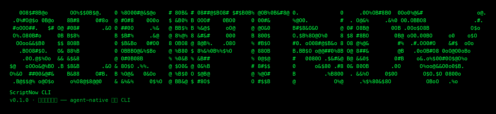

# scriptnow-cli

**从灵感到成书 —— agent-native 创作 CLI**

[English](README.en.md) · [中文](README.md)

<p align="center">
  
</p>

> 面向**命令行用户与 AI Agent**：建项目、一书一 Skill 解读、小说/剧本创作、Skill 进化、
> 封面生成、导出交付，全部可用命令行完成。非命令行创作者请使用网页端。

基于 [CLI-Anything](https://github.com/HKUDS/CLI-Anything) 模式的一站式命令行，覆盖**小说与剧本
两条创作域（dual-domain）**。所有命令支持 `--json` 结构化输出，供 AI Agent 直接编排。

## 特性

- **双域创作链**：小说（卷×章）与剧本（剧集×场次）共享「项目 → 方向 → 规划 → 创作 → 交付」，
  但规划结构与创作循环按域细化，Agent 按域编排。
- **样本不传平台**：一书一 Skill 用 `interpret local` 在 Agent 本地解读作品、产出方法论后回传，
  平台只接收最终 Skill，不接触作品原文；改编稿用 `chapter propose` / `script scene-propose` 本地回传。
- **Skill 能力与版本进化**：`skill growth` 从创作实绩提炼方法论、评估后发布新版本；
  `skill canary` 对新版本做灰度决策（retain / limit / need_evidence / rollback）。
- **管理员支线**：`admin` 命令组仅 `is_admin` 可用（非管理员 403）；token 消费、额度与财务命令
  一律不纳入 CLI。
- **Token 预算控制**：本地导入（propose / scene-propose / interpret local）带 `--budget` 预估拦截。
- **审读是 Agent 自身能力**：平台不提供固定 rubric，Agent 读正文、自行判断、用 `--feedback` 驱动修正。
- **会话自动续期**：一次 `login` 后 access token 过期自动用 refresh token 续期（30 天有效、持久化写回），
  Agent 长会话无需反复登录；仅改密/管理员重置/主动登出后需重新 login。
- **Agent 操作契约**：`scriptnow agent-guide`（`--json` 结构化）输出连接平台的唯一准则——平台是事实源、
  规划三件套回填优先、生成命令后台轮询、StoryMap 修订需用户明确授权。
- **双域阶段语义**：叙事阶段不决定小说卷边界；剧本 `volume_two` 表示每集场数，阶段比例据此按每集场数解释。
- **新增卷章 = 纯追加**：`storymap append-volume` / `storymap append-chapters` 只尾部新增，已有卷章
  id/序号/标题/字数完全不动；被替换的旧结构自动归档，平台「结构历史」可查看导出。
- **集纲 / 章纲先于正文**：StoryMap 不能只提供 episode/scene 或 volume/chapter 容器。剧本每个
  `episode` 需填写平铺字段 `logline`、`active_goal`、`conflict`、`turn`、`state_changes`、`anchor_ids`；可用
  `script episode-outline <pid> <episode_id> @outline.json` 补单集；
  小说每个 `chapter` 需填写嵌入的 `outline`（`summary`/`logline`、`active_goal`、`conflict`、`turn`、
  `state_changes`，锚点可来自 outline 或 beat）；先运行
  `script/novel planning-quality`，全量通过并经作者采纳后才可写正文。历史章节（已有正文）可读可写，不受章纲字段缺失影响；新章节必须带完整章纲（提交前可用 `chapter outline-check` 自查、`chapter outline-example` 看结构示范）。

## 安装

要求 Python 3.10+。macOS/Linux 系统 Python（Homebrew、python.org）受 PEP 668 保护时，
请先在虚拟环境中安装：

> ⚠️ **CLI 不在 PyPI**：`pip install scriptnow-cli` 会报 "No matching distribution"。
> 安装/升级优先走**生产分发源**（sn.igeewa.com，wheel 直装、不依赖 git）；GitHub
> codeload / git+https 仅作兜底。`scriptnow self-upgrade` / `config on` 后台自动升级
> 同样优先生产源。

**生产源直装（推荐）——从平台分发域名下载 wheel，最稳定**：

```bash
# 固定版本
pip install https://sn.igeewa.com/downloads/scriptnow-cli/scriptnow_cli-0.3.75-py3-none-any.whl
# 源码包（zip）
curl -sL -o /tmp/scriptnow-cli.zip https://sn.igeewa.com/downloads/scriptnow-cli/scriptnow-cli-v0.3.75.zip
```

**GitHub 兜底（生产源不可达时）**：

```bash
# 从源码（editable，开发推荐）
git clone https://github.com/quchenchen/scriptnow-cli.git
cd scriptnow-cli && pip install -e .

# codeload tar.gz 直连（无需 clone，不依赖 git 协议）
curl -sL -o /tmp/scriptnow-cli-latest.tar.gz https://codeload.github.com/quchenchen/scriptnow-cli/tar.gz/refs/heads/main
pip install --force-reinstall /tmp/scriptnow-cli-latest.tar.gz

# 固定 tag 版本
pip install "https://codeload.github.com/quchenchen/scriptnow-cli/zip/refs/tags/v0.3.75"
```

已安装用户：`scriptnow self-upgrade` 自动按「生产源 → codeload → git+https」依次尝试；
或 `scriptnow config on` 开启「有新版本时后台自动升级 + 通知」。

## 登录

```bash
scriptnow login --host https://sn.igeewa.com --email 你的账号   # 交互式隐藏输入密码（或 --password-stdin / SCRIPTNOW_PASSWORD）
```

会话保存到 `~/.config/scriptnow-cli/session.json`（仅 Cookie，不含密码，权限 0600）。
也可用 `SCRIPTNOW_BASE_URL` / `SCRIPTNOW_EMAIL` / `SCRIPTNOW_PASSWORD` 环境变量。

**会话自动续期**：access token 约 60 分钟过期，CLI 会**自动**用 refresh token 续期并写回本地文件
（refresh 有效 30 天）——一次登录后 30 天内无需再登录，Agent 长会话也不会中途失效。
仅当 refresh 也过期（30 天未用）或改密/管理员重置密码/主动登出后，才需要重新 `scriptnow login`。

### 配置与会话定位（Agent 必读）

| 内容 | 位置 |
|---|---|
| 登录会话（Cookie + CSRF） | `~/.config/scriptnow-cli/session.json` |
| 版本检查缓存 | `~/.config/scriptnow-cli/version-check.json` |
| 新手引导标记 | 写入 `~/.config/scriptnow-cli/`（onboarded 标记） |
| 环境变量覆盖会话路径 | `SCRIPTNOW_CLI_CONFIG=/path/to/session.json` |

**排查入口：先跑 `scriptnow doctor`** —— 一条命令输出：CLI 版本、会话文件实际路径、
是否已登录、登录账号、平台地址、连通性。Agent 遇到「登录失败 / 找不到配置 /
409 权限 / No such option」时，**第一步永远先 `scriptnow doctor`**，不要猜配置位置。

要点：
- 多个 Python 环境（venv/pipx/系统）装的 scriptnow 若**共用同一会话文件**，登录一次全部生效；
  若环境变量 `SCRIPTNOW_CLI_CONFIG` 不同则各自独立。
- `scriptnow doctor` 显示「未登录」→ 重新 `scriptnow login`；显示「已登录但 409」→
  会话令牌轮换竞态，重新登录即可（多端同时刷新时旧令牌会触发一次性保护）。
- 配置目录由 CLI 自动创建（0700），无需手工维护；误删 session.json 只会要求重新登录，不丢任何作品数据。

## 快速开始（双域）

**前置：Skill 支撑检查**（创作前必做）——项目缺方法论 Skill 时先创建再创作：

```bash
scriptnow skill mounts <pid>                  # 项目已挂载哪些 Skill？
# 无 → 一书一 Skill 蒸馏（样本不传平台）：interpret local 手稿.docx --spec → 本地解读 → --submit @skill.json --project-id <pid>
#   或 个人 Skill：skill create --domain novel|script ... → skill mount <pid> <skill_id> <version_id>
```

**小说（卷 × 章）**

```bash
scriptnow project create --name 新作 --medium novel --volume-one 1 --volume-two 15 --chapter-target-words 1200
scriptnow project direction <pid> --apply @direction.json --review-token <方向审阅凭证>
# 规划（回填优先：提交候选与采纳分开；每次采纳绑定候选全文 digest）
scriptnow novel propose <pid> cores @cores.json --review-token <提交审阅凭证>
scriptnow review candidate-preview novel <pid> story_core_candidate <candidate_id>
scriptnow novel adopt-core <pid> <candidate_id> --review-token <采纳审阅凭证>
scriptnow novel propose <pid> blueprint @blueprint.json --review-token <提交审阅凭证>
scriptnow novel propose <pid> storymap @storymap.json --review-token <提交审阅凭证>
scriptnow novel planning-quality <pid> storymap @storymap.json  # 章纲全量质量门禁
scriptnow novel orchestrate <pid> --skip-adopt               # 只读编排；采纳走独立审阅命令
# 新增卷/章（纯追加，不动已有卷章；新章 beats 引用蓝图锚点须已存在）
scriptnow storymap append-volume <pid> @new-volumes.json --review-token <提交审阅凭证>
scriptnow storymap append-chapters <pid> volume-1 @new-chapters.json --review-token <提交审阅凭证>


### 按叙事结构分阶段创作（Phase 1/2）

叙事结构（`direction.structure`：`three_act` / `hero_journey` / `kishotenketsu` / `linear` / `custom`）被解析为可计算的幕/阶段模型。分阶段模式下，Novel 阶段按全书章区间规划，不强制每个阶段对应一个卷；`volume_count × chapters_per_volume` 决定总章数目标，作者可自行组织分卷。

```bash
# 预览阶段计划（只读：阶段/目的/全局章序/入口出口）
scriptnow storymap phases <pid>

# 提交下一个未完成阶段（Novel 按全书章区间；采纳仍走 storymap adopt）
scriptnow storymap append-phase <pid> <phase-key> @chapters.json --review-token <提交审阅凭证>
scriptnow storymap adopt <pid> --latest --confirm --review-token <采纳审阅凭证>
```

**分阶段模式 = 多轮连贯性创作**：每阶段是一轮，轮轮以已采纳前缀相接（阶段间伏笔/线程跨轮延续），合起来是一部完整、自洽的作品——不是各写各的碎片。阶段只约束跨章的宏观走向（入口/出口、跨阶段线程），**不干预单章内的节奏、伏笔与钩子**。
# 创作循环（Agent 审读驱动；生成默认后台，用 run status 轮询）
scriptnow book <pid>                                          # 编排原语：各章已采纳/待生成/候选待审
scriptnow chapter outline <pid> chapter-1-1 @outline.json --review-token <提交审阅凭证>
scriptnow chapter outline-batch <pid> @outlines.json --review-token <提交审阅凭证>
scriptnow chapter show <pid> chapter-1-1 --plain
scriptnow chapter generate <pid> chapter-1-1 --feedback "你的意见"   # 后台，返回 run_id
scriptnow run status <run_id>                                 # 轮询到 succeeded/failed（交互终端可用 --wait）
scriptnow chapter adopt <pid> chapter-1-1 <rev> --human --review-token <定稿审阅凭证>
# 改编稿本地回传：chapter propose <pid> chapter-1-1 --file @blocks.json --review-token <提交审阅凭证>
```

**剧本（剧集 × 场次）**

```bash
scriptnow project create --name 新剧 --medium script --point-of-view "限知跟随主角" --volume-one 10 --volume-two 2-4 --volume-three 3
scriptnow project direction <pid> --apply @direction.json --review-token <方向审阅凭证>
# 规划（回填优先）
scriptnow script propose <pid> cores @cores.json --review-token <提交审阅凭证>
scriptnow review candidate-preview script <pid> story_core_candidate <candidate_id>
scriptnow script adopt-core <pid> <candidate_id> --review-token <采纳审阅凭证>
scriptnow script propose <pid> blueprint @blueprint.json --review-token <提交审阅凭证>
scriptnow script propose <pid> storymap @storymap.json --review-token <提交审阅凭证>
# 每个 chapter/episode 都要有对应章纲/集纲字段；先质量门禁再采纳
scriptnow script planning-quality <pid> storymap @storymap.json
# 创作循环（生成默认后台）
scriptnow script scene-list <pid>
scriptnow script scene-show <pid> scene-1-1 --plain
scriptnow script scene <pid> scene-1-1 --feedback "你的意见"   # 后台，返回 run_id
scriptnow run status <run_id>                                 # 轮询
scriptnow script adopt-scene <pid> scene-1-1 <rev> --human --review-token <定稿审阅凭证>
# 改编稿本地回传：script scene-propose <pid> scene-1-1 --file @blocks.json --review-token <提交审阅凭证>
```

**交付**：`cover generate` 封面 → `export create --units chapter-1-1|scene-1-1` → `export download -o 书.docx`。
剧本使用 `--form working` 时 DOCX 带每场预计时长、发声数量与转场信息；内部制作契约暂不作为编剧交付文件导出。

## 命令组

| 组 | 用途 |
|----|------|
| guide | 聚焦式新手创作向导（outline-first 逐层深入）：`--step 1..12 --medium novel|script`；`--pulse/--resume` 柔性回归；`--steps` 查看全图；`--complete/--status` 完成标记与完成状态 |
| agent-guide | **Agent 操作契约**：连接平台唯一准则（--json 结构化输出） |
| authorize | 签发一次性「人工决策授权令牌」（对话内文字授权通道，复用登录会话不要求重新登录）：`--chapter/--scene` 限定目标，`--digest` 绑定用户已读内容；token 供 `chapter adopt --human --token` / `scene adopt --human --token` 完成人工定稿 |
| review | 人类审阅回路：`preview` 展示本地候选 / `candidate-preview` 展示平台规划候选 / `status` 读取决定与意见 / `confirm` 登记一次决定 / `claim` 由 Agent 领取凭证；页面可选 |
| project | 项目管理：创建 / 列表 / **files（项目文件）** / 上传素材 / **use（设为默认项目）** / 删除 / 方向（--apply 客户端梳理回填 / --inspire 平台灵感） |
| interpret | 一书一 Skill：go（一键解读）/ local（Agent 本地解读，样本不传平台）/ create / read / status / decide |
| book | 全书托管创作规划（Agent 编排原语，含 Skill 支撑侦测） |
| chapter | 小说章节：**outline（单章补纲）/ outline-batch（批量补纲）/ outline-check（章纲自查）/ outline-example（章纲结构示范）/ bible-example（人物圣经范例）** / list / show / generate / quality（--standard 内容/备案/千部）/ adopt / propose（本地回传） |
| scene | 剧本场次（chapter 的剧本侧对称）：list / show / generate / adopt（alias of script adopt-scene）/ propose（本地回传）/ batch（批量串行）/ quality / diff |
| storymap | 跨域共享结构命令（novel+script 通用）：state / generate / **append-volume（新增卷，纯追加）** / **append-chapters（新增章，纯追加）** / **append-phase（按叙事阶段提交下一未完成阶段，Novel 按全书章区间）** / **phases（按叙事结构推导的阶段计划预览）** / adopt（**高危，需 --confirm**） / **structures（内置 + 结构库已存模板）** / **structure-save（命名结构存库，--description/--medium 元数据）** / **structure-delete**；隔离重建走各域 storymap-rebuild-* 链 |
| novel | 小说创作链：story-cores / blueprint / adopt-core / adopt-blueprint / bootstrap / outline / outline-adopt / outline-status / graph（叙事图谱对账）/ planning-quality / planning-status / ready-check / propose（本地 JSON 导入）/ orchestrate / **rough-outline 平铺链：rough-outline / adopt / check / example** / **storymap-rebuild 隔离重建链：start / rebuild / rebuild-phase / rebuild-phase-preview / rebuild-check / rebuild-propose** / **storymap-archives / storymap-archive（旧结构归档读取）**；重建须先采纳小说粗纲，阶段按全书章区间且不强制一阶段一卷 |
| script | 剧本创作链：outline / outline-adopt / outline-status / episode-outline / **episode-outline-check / episode-outline-example** / **bible-example** / state / story-cores / blueprint / adopt-blueprint / adopt-core / storymap / **storymap-phases / storymap-append-phase** / adopt-storymap（高危）/ planning-quality / **ready-check** / propose（本地 JSON 导入）/ adopt-scene / scene / scene-list / scene-show / scene-propose（--help-format/--example；--auto-adopt 已停用）/ scene-batch / scene-quality / scene-diff / quality-report / **rough-outline 分阶段链：-start / -phase / -progress / -propose / -phase-preview / -check** / **storymap-rebuild 隔离重建链：start / rebuild / rebuild-phase / rebuild-phase-preview / rebuild-check / rebuild-propose** / **storymap-archives / storymap-archive（旧结构归档读取）** |
| storyboard | 分镜回填链：state / source-preflight / source-import / source-range / source-revoke / propose / assets / asset-add / continuity / **scene-board upload|generate|list|inspect|delete** / readiness / export；规划板是显式单场操作，不写 shot.frame_refs |
| translate | 故事归化：create / analyze-source / target-contract / strategies / mappings |
| cover | 封面：package（平台生成包装包）/ package-propose（Agent 自主提交包装文案）/ package-show / models / specs / generate（默认 1 张 1024×1600）/ list / delete |
| export | 导出交付：options / create / **preview（交付范围审阅，返回一键审阅地址）** / download / zip；剧本 working DOCX 含每场制作信息 |
| skill | Skill 工坊：craft（共创、预检、确认、挂载回读）/ list / create / **detail（个人 Skill 摘要）** / update / versions / archive / mount / mounts / upload；**growth**（方法论进化）；**canary**（版本灰度） |
| admin | 管理员专用（仅 is_admin，非管理员 403）：status / tenant-status / skills / skill-show / skill-update / supply / provider-connect / model-add / image-model-add |
| run | 运行排查：status / events |
| feedback | CLI 诊断包收集：版本 / 近期错误 / 命令记录；默认仅本地生成，--send 才发送平台（不含密码、令牌、正文） |
| version / self-upgrade / config | 版本查看（--check 强制联网检查）/ 自动升级（先检查、用户确认后执行；启动时会后台低频提示新版）/ `config on|off` 开启或关闭「有新版本时自动升级」（默认关闭；开启后后台自动升级并在升级前后通知，不阻塞命令） |

**StoryMap 隔离重建（novel/script 的 storymap-rebuild-* 链）**：必须先采纳该域粗纲；
`storymap-rebuild-start` 冻结阶段计划与现有 StoryMap，逐阶段（小说按全书章区间、不强制分卷；剧本按集区间）
先 `rebuild-check` 确定性预检再 `rebuild-phase` 累积；全部完成后 `rebuild-propose` 合并为
完整替换候选，不自动采纳；用户明确确认后才经 `storymap adopt --confirm` 替换，旧结构与正文
快照自动归档可回溯（novel：`storymap-archives <pid>` 列出、`storymap-archive <pid> <归档ID>` 查看
单份；script 镜像：`script storymap-archives <pid>`、`script storymap-archive <pid> <归档ID>`，
均含被替换的完整集场/卷章结构与各章/场正文快照）。

场次规划板的视觉代理参数显式传递给平台：`--layout auto|2x2|2x3|3x3|3x4|4x4` 与
`--mode annotated|seedance_sequence`。上传使用 multipart，服务端返回最终 layout/pages/shot_ids/digest/source。
图片代理拒绝资产参考图时，平台会保留失败 Attempt，并以无参考图的新 Attempt 安全重试；
`reference_validation` 会列出 accepted/rejected 及原因。出现 rejected 时应补传资产参考图，再追求人物与场景一致性。
平台生成的资产参考图与规划板会先持久化到项目工作区；后续多参考生图从本地媒体编码 base64，
不依赖供应商临时 URL。CLI 仍只使用平台返回的稳定媒体地址，不读取数据库或本地路径。

## 聚焦式新手模式

默认 `scriptnow guide` 不再打印整套命令墙，而是从第一幕开始。每一幕只提出一个创作问题；
没有灵感时任选一个观察角度，Agent 先复述理解、再给一个候选，用户只需决定“保留 / 调整 / 换方向”。
技术命令由 Agent 在幕后执行。

逐章/逐场定稿采用“一次明确表达”原则：用户在 Agent 对话中说“定稿”“采用这版”
或“可以继续”，Agent 在后台登记原话、领取绑定当前版本 digest 的一次性凭证，再执行
`chapter adopt --human` / `scene adopt --human`。用户不操作终端、不复制凭证；表达不明确时只追问一次。

剧本 Skill 在用户专属规则之外自动叠加四类质量锚点：场次功能与转折、可见可听可表演、
对白/VO/OS 时序、台词量与目标时长。系统自动派生制作信息，不增加编剧问卷或机器字段维护。
项目创建时锁定的剧本格式始终先于个人 Skill 加载；竖屏短剧分镜式、中国剧本、好莱坞格式
各自使用独立生成、前端显示和导出契约。个人 Skill 只增加题材方法，不得混用或覆盖格式。

## 人类审阅协议（对话优先）

人是创作的观察者和决定者，Agent 是执行者。方向、故事核心、蓝图、人物圣经、粗纲、StoryMap
集纲/章纲、正文修订、采纳和导出，都经过同一条轻量回路：Agent 从平台读取事实，完整呈现候选；
用户在对话中只表达一次「保留 / 调整 / 换方向」；Agent 后台登记原话、读取意见，并在保留时领取
绑定候选 digest 的一次性凭证，完成写入后回读平台结果。用户无需复制 token、重复敲命令或打开页面。

内容发生变化时旧 digest/凭证立即失效，Agent 必须重新展示新版本。长内容可以附带 `review_url`
作为可选阅读工具，页面不是额外审批关卡；用户直接在前端编辑并保存，本身就是一次人类决定，
平台记录同样的审计信息。

长篇剧本的粗纲按项目叙事结构分阶段回填，但结构区间只是初始建议：作者可调整连续边界。
`rough-outline-start/progress/phase` 每次都回显「阶段 X / 共 N 阶段」、当前阶段和已完成阶段，
不得让阶段 JSON 只在后台推进。

下面的命令通常由 Agent 在后台完成，不要求用户离开当前对话：

```bash
# 登记并展示完整候选；不写入创作内容
scriptnow review preview <pid> <resource-kind> <resource-id> @candidate.json
# 用户在对话中给出一次决定后，Agent 登记原话并领取一次性凭证
scriptnow review confirm <packet-id> --decision retain --evidence "采用这一版，继续下一阶段。"
scriptnow review claim <packet-id> --json
# 调整时读取用户意见，修订后重新 preview；不复用旧凭证
scriptnow review status <packet-id> --json
```

`review status` 让 Agent 直接读取用户反馈，不要求用户再说一遍；`--evidence` 应保留用户原话，
不能用 Agent 自己的总结替代。`--json` 只服务于 Agent 编排，不能替代用户看到的完整内容。

```bash
scriptnow guide --step 1 --medium novel --json
scriptnow guide --step 1 --medium script --json
scriptnow guide --steps
# 多轮发散后：轻量判断 on_track / useful_detour / drifting / conflict，不写平台状态
scriptnow guide --step 4 --medium novel --pulse @pulse.json --json
# 明确需要收拢时，也可直接温和接回
scriptnow guide --step 4 --medium novel --resume --json
```

## Skill 能力与版本进化

```bash
# 能力进化（方法论成长）：从创作实绩提炼 → 评估 → 发布新版
scriptnow skill growth start <pid> --domain novel        # 启动分析（后台）
scriptnow skill growth workspace <pid>                   # 查看候选与历史 runs
scriptnow skill growth decide <candidate_id> --action accept|edit|reject ...
scriptnow skill growth evaluate <candidate_id>           # 评估回放（后台）
scriptnow skill growth preview <candidate_id> --evaluation-result <id>
scriptnow skill growth publish <candidate_id> --evaluation-result <id> \
  --description "..." --instructions "..." --mount <pid> # 发布新版（--mount 触发 canary 灰度）

# 版本进化（金丝雀灰度）
scriptnow skill canary list
scriptnow skill canary decide <canary_id> --action retain|limit|need_evidence|rollback
```

## 管理员 CLI

`admin` 组仅 `is_admin` 用户可用（后端校验，非管理员 403）：平台系统状态、租户启停、
主站 Skill 治理与能力进化（`skill-update` 需 `--expected-digest` 防并发覆盖）。
**token 消费、额度与财务命令一律不纳入 CLI**——这些走管理后台。

## 已知缺口（后端已具备、CLI 未覆盖）

onboarding、commerce（Paddle 订阅）、review-agent（审读工作台）、
evaluation v9（深度评估）、work-completion（完结）、invitations（邀请码）——按需补齐。

## AI Agent 安装（SKILL 体系）

Agent（Claude Code / npx skills 兼容）可通过 SKILL.md 发现能力：

```bash
npx skills add quchenchen/scriptnow-cli --skill scriptnow-cli -g -y
```

SKILL.md 位于 [`cli_anything/scriptnow/skills/SKILL.md`](cli_anything/scriptnow/skills/SKILL.md)。

## Agent 使用提示

- **先读短运行契约（MANDATORY）**：安装入口只含执行边界；每个 Agent 首次动作前必须运行
  `scriptnow agent-guide --json`（完整人工手册用 `--full`）——平台是事实源、
  规划三件套回填优先、禁止体外项目创建（缓存/资料整理除外）、生成命令后台轮询、
  StoryMap 修订需用户明确授权（Agent 不得代替采纳）。
- **审阅凭证精确绑定**：凭证绑定用户实际阅读的可读 JSON；解析器默认值不得被当作内容变化。
- **编排前置：Skill 是逐章/逐场创作前的必然门禁（MANDATORY，且须健壮性完善）**：
  创作意图明确且项目落地后，先与用户规划专属方法论（可多轮），再试写样本章节/场次检验
  Skill 约束力、诊断缺口并迭代加固（健壮性完善），然后在平台创建并挂载到项目
  （interpret local 蒸馏 或 skill create），最后 `skill mounts <pid>` 核实已挂载，才能启动
  正文逐章/逐场创作。`book` 也会在缺 Skill 时硬停提示。
- **必须主动填充完整 direction**：用 `project direction <pid> --apply @direction.json` 回填
  premise/tone/world_setting/genre/structure/卷章数/字数等；不要依赖 `--inspire`，也不要建裸项目。
- **规划回填优先**：story_cores / blueprint / storymap 默认由 Agent 本地生成后 `propose` 回填为候选；
  平台端 generate 仅作后备，不要把平台生成当作首选路径。
- **正文创作双模式（用户明确选择，平台侧不阻塞）**：默认由平台主笔完成——`chapter/scene generate`
  生成候选 → `review preview` 审读 → `adopt`；仅当用户**明确选择本地创作**时，Agent 才在本地写好
  正文后经 `chapter propose` / `script scene-propose` 回填候选 → `review preview` 审读 →
  `adopt --human`。未明确选择时一律按平台主笔执行；本规则只约束正文（章节/场次）创作，
  「规划回填优先」（story_cores / blueprint / storymap 规划三件套）保持不变、不受影响。
- 优先 `--json`；**生成命令默认后台并返回 run_id，用 `run status` 分次轮询**——
  不要用 `--wait` 长阻塞（宿主工具轮候窗口有限会超时）；交互终端可用 `--wait` 或设
  `SCRIPTNOW_WAIT_MAX_SECONDS` 限制单次等待。平台拒绝操作时，CLI 会优先透出经脱敏的
  原始领域 detail；`--json` 失败统一返回 `{ok:false,error:{type,status,detail}}`，不输出 traceback。
  运行失败按 `run status` 的 `error/detail` 修正，再用 `run events <run_id> --json` 读取事件；无事件固定为
  `events=[]`。Agent 必须按其中的可行动提示修正，不能把中文通用兜底当作修复指令。
- **报告完成以服务器回读为据**：写操作成功 = 服务器返回 id（project_id/candidate_id/revision_id/run_id）且回读确认落盘；
  没有 id 与回读确认不得向用户报告“已完成”；`project create` 会自动回读并输出含 `verified` 的 receipt。
- **StoryMap 修订是超级高危操作**：`storymap adopt` 必须 `--confirm`（平台需勾选知情确认）；
  新增卷/章请用 `append-volume` / `append-chapters`（纯追加，不动已有卷章）；
  被替换的旧结构与正文快照自动归档，平台「结构历史」可查看导出。
- 版本管理：创作基准 = 最新「已采纳 + 人工修订（未采纳也算）」，未采纳的 Agent 候选不进入基准。
- 审读是 Agent 自身能力：读正文 → 判断 → `--feedback` 驱动修正。

## 安全说明

- 会话只存 Cookie 不存密码；文件权限 0600。
- 所有写操作走平台同一套鉴权（Cookie + CSRF + tenant 隔离），无法越权访问其他用户数据。
- 平台核心能力（内置 Skill、管理端点、工具目录）不通过 CLI 暴露——admin 命令组仅 is_admin 可用。


## 质量评估标准

- `chapter quality --standard` 评估**默认使用内容质量偏好**（人物能动性/场景因果/关系推进/叙述声音/连贯性/源边界/章节推进/文本质感）；
  仅当用户明确提出 **真人剧备案口径**（`--standard drama-filing`）或 **千部计划/批量网文标准**（`--standard thousand-plan`）时才附加对应标准。
- 评估 = **Agent 系统评估 + 平台建议维度**：CLI 提供平台维度与场次原文，Agent 按维度逐项系统评估、引用证据。

## 规格示例

`chapter propose --help-format / --example`、`script scene-propose --help-format / --example` 展示**格式规格示例**
（blocks JSON 结构/正文分段），仅保证格式合规，**不代表质量水准**——质量由 Agent 按上述评估维度判断。
